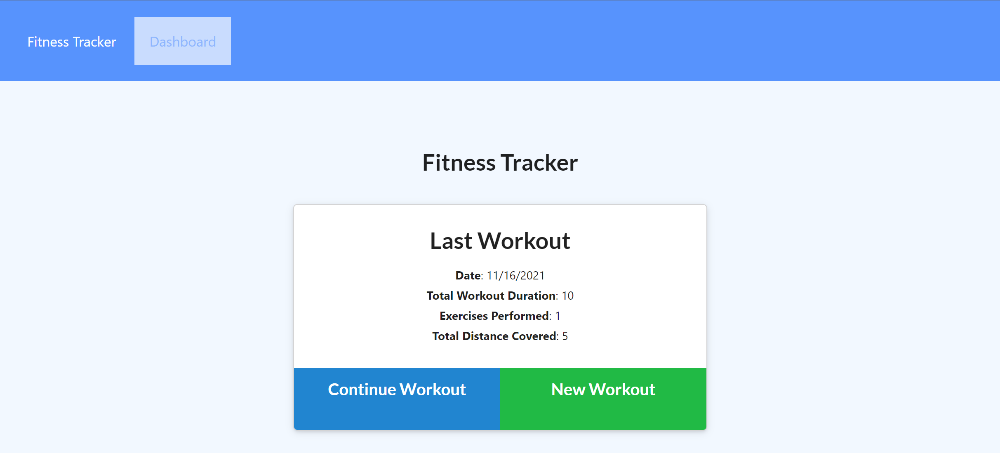
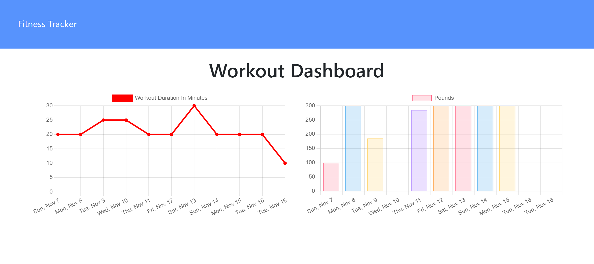

# fitness-tracker

## Description

This application serves as an online fitness tracker. 

The user is able to update the database with either a resistance or cardio workout. 

This app is an easy to use, intuitive way of documenting information related to the user's fitness goals. 

As usual, I learned the importance of deploying early to Heroku. 

The deployed version of the application can be found at:
https://fitness-tracker-els-2021.herokuapp.com/

## Table of Contents 

1. [Installation](#installation)
2. [Usage](#usage)
3. [License](#license)
4. [Questions](#questions)

## Installation

In order to install this product, you need to:
There are no steps necessary to run the app if you are accessing it from the deployed link. If you are trying to run the code locally, you will need to run npm install, npm run seed, and npm start.

## Usage 

This fitness tracker has web pages that display your last workout along with cumulative statistics, a web page for adding a new workout, and a summary page that displays the user's progress over time. 

## License

The license for this application is MIT.

## Questions

If you have any questions about this application, my github profile is https://github.com/ericaleesnyder, and you can email me at ericaleesnyder@gmail.com. 